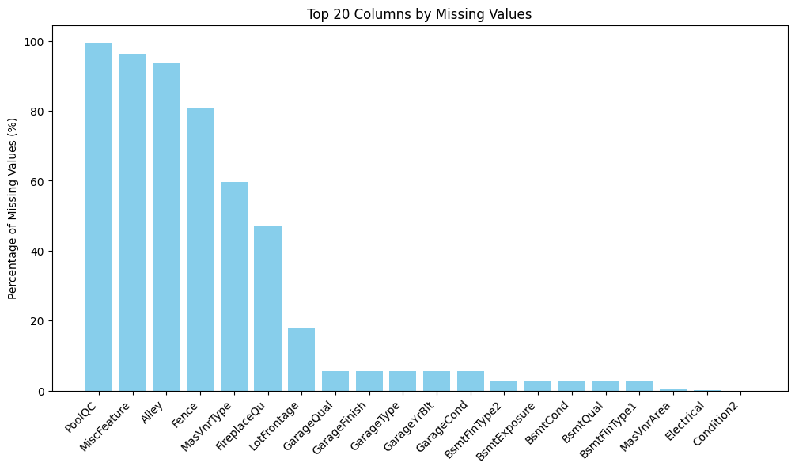

# მონაცემთა გაწმენდა და დამუშავება (Cleaning & Preprocessing)

1. გამოტოვებული მნიშვნელობების (NA) მქონე სვეტების დადროპვა

   სვეტები, სადაც missing value-ების პროცენტი ძალიან მაღალი იყო, სრულად ამოვშალე:

